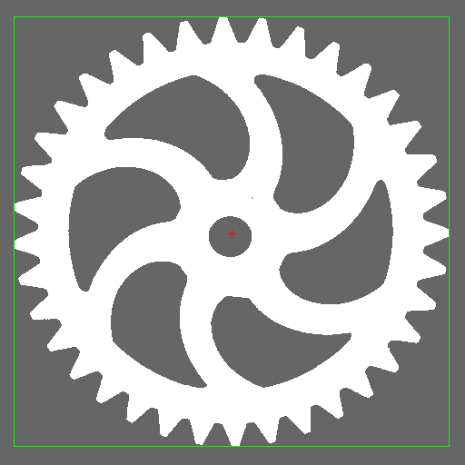

# Regions

[](https://schrpe.github.io/Regions.jl/dev)
[](https://github.com/invenia/BlueStyle)

Regions.jl defines a set of types and functions that model a discrete 2-dimensional region concept.

Regions can be used for various purposes in machine vision and image processing. Since they provide an efficient run-length encoding of binary images, they avoid the need to touch every pixel when doing binary morphology and thus enable substantial speedup of such operations. Regions are also the basis for binary blob analysis, where the calculation of shape-based features is substantially accelerated because of the run-length encoding.

Operations on regions scale with the number of runs, not with the image area; on sparse industrial images this is typically orders of magnitude faster than pixel-array morphology and component analysis.


Examples of regions: two simple regions, a region with a hole and a region consisting of two parts.

## Quick example

Threshold the gear test image, find its bounding box and area-weighted centroid,
and render the result as an overlay:

```julia
using Regions, Images, FileIO

img    = load("test/gear.png")
region = binarize(img, px -> px < 0.9)
blob   = argmax(area, components(region))

l, t, r, b = bounds(blob)              # math y-axis convention: t > b
y1, y2     = min(t, b), max(t, b)      # row range for image-array indexing
cc, cr     = centroid(blob)            # area-weighted centre (column, row)

out = RGB.(img .* 0.4)
for run in blob.runs, row in run.rows
    out[row, run.column] = RGB(1, 1, 1)
end
out[y1,    l:r] .= RGB(0, 1, 0); out[y2,    l:r] .= RGB(0, 1, 0)
out[y1:y2, l]   .= RGB(0, 1, 0); out[y1:y2, r]   .= RGB(0, 1, 0)
ci, ri = round.(Int, (cc, cr))
for d in -4:4
    out[ri,     ci + d] = RGB(1, 0, 0)
    out[ri + d, ci    ] = RGB(1, 0, 0)
end

save("gear_example.png", out)
```


