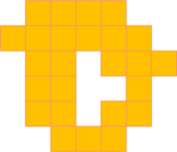
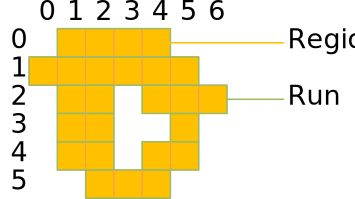

# Regions.jl

Regions.jl defines a set of types that model a discrete 2-dimensional region concept. 



In order to use the types and functions defined in the Regions package, you must first install it with the package manager and then make it known to your module:

```jldoctest reg
julia> using Regions
```

Regions can be used for various purposes in machine vision and image processing. Since they provide an efficient run-length encoding of binary images, they avoid the need to touch every pixel when doing binary morphology and thus enable substantial speedup of such operations. Regions are also the basis for binary blob analysis, where the calculation of shape-based features is also substantially accelerated because of the run-length encoding. Finally, regions can be used as the domain of image processing functions.

## Introduction

A region can be seen as a set of discrete coordinates in the cartesian plane. In fact, one of the main motivations for the region concept was to model a set of pixel locations for image processing purposes.

A region is represented with a sorted list of horizontal runs. Runs themselves are represented with a horizontal columns range and a vertical row coordinate.



Here is how this region can be created using the Julia REPL (assuming the origin (0, 0) is at the upper left):

```jldoctest reg
julia> Region([Run(0, 1:4), Run(1, 0:5), Run(2, 1:2), Run(2, 4:6), Run(3, 1:2), Run(3, 5:5), Run(4, 1:2), Run(4, 4:5), Run(5, 2:4)])
Region(Run[Run(0, 1:4), Run(1, 0:5), Run(2, 1:2), Run(2, 4:6), Run(3, 1:2), Run(3, 5:5), Run(4, 1:2), Run(4, 4:5), Run(5, 2:4)], false)
```

### Range

The most basic building block of a region is a range. The `UnitRange{Int64}` is a suitable type and can be written like this:

```jldoctest reg
julia> 0:99
0:99

julia> (0:99).start
0

julia> (0:99).stop
99

julia> length(0:99)
100

julia> length(-50:50)
101
```

A range where the stop is less than the start is considered empty.

```jldoctest reg
julia> isempty(0:0)
false

julia> isempty(1:0)
true
```

The natural sort order of ranges is to sort them by their start.

```jldoctest reg
julia> 0:100 < 1:101
true

julia> 0:1 < 1:100
true

julia> 0:50 < 0:100
true

julia> isless(0:100, 1:101)
true
```

Inversion mirrors a range at the origin.

```jldoctest reg
julia> invert(0:100)
-100:0

julia> invert(invert(5:10))
5:10
```

Translation moves a range by an offset.

```jldoctest reg
julia> translate(0:100, 50)
50:150

julia> (10:20) + 30
40:50

julia> 10 + (20:30)
30:40

julia> (50:100) - 10
40:90
```

You can check whether a value is contained in a range.

```jldoctest reg
julia> contains(10:20, 10)
true

julia> contains(10:20, 15)
true

julia> contains(10:20, 20)
true

julia> contains(10:20, 9)
false

julia> 14 ∈ 10:20
true
```

Two ranges can overlap or touch.

```jldoctest reg
julia> isoverlapping(10:20, 5:25)
true

julia> isoverlapping(0:0, 1:1)
false

julia> istouching(0:0, 1:1)
true

julia> istouching(0:0, 2:2)
false
```

### Run

A run combines a vertical row coordinate with a range of horizontal columns coordinates.

An empty run is a run whose columns range is empty.

```jldoctest reg
julia> isempty(Run(0, 0:-1))
true

julia> isempty(Run(0, 0:100))
false
```

The natural sort order of runs is to sort them by their row, then by their columns range.

```jldoctest reg
julia> Run(0, 0:100) < Run(1, 0:100)
true

julia> Run(0, 0:100) < Run(0, 1:101)
true
```

Inversion mirrors a run at the origin.

```jldoctest reg
julia> invert(Run(10, 50:100))
Run(-10, -100:-50)

julia> invert(invert(Run(1, 5:10)))
Run(1, 5:10)
```

Translation moves a run by horizontal and vertical offsets.

```jldoctest reg
julia> translate(Run(0, 0:100), 10, 20)
Run(10, 20:120)

julia> Run(0, 10:20) + [30, 40]
Run(30, 50:60)

julia> Run(0, 10:20) - [30, 40]
Run(-30, -30:-20)
```


### Region

A region is a subset of the discrete two-dimensional space. It represents a set (in the sense of mathematical set theory) of discrete coordinates. A region may be finite or infinite. A region may not be connected and it may contain holes.

Regions are an essential concept in computer vision and are useful in many respects.

Regions are not necessarily related to images; they can exist independently and without images. In addition, the coordinate space is not confined to the bounds of an image, and regions can extend into the quadrants with negative coordinates in the two-dimensional space.


## Contents

```@contents
```

## Reference

```@autodocs
Modules = [Regions]
```

## Index

```@index
```

[^Ghali]:

    Sherif Ghali, Introduction to Geometric Computing, Springer 2008


