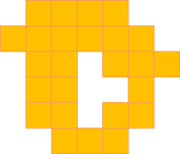
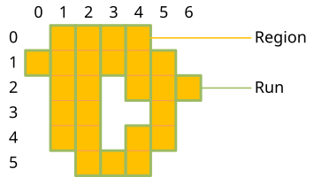
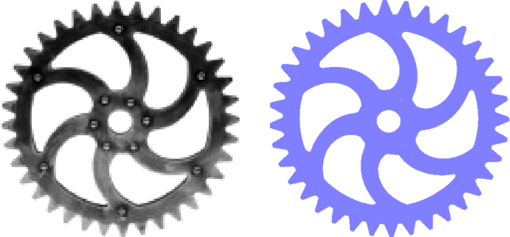

```@meta
CurrentModule = Regions
```

# Regions

Documentation for [Regions](https://github.com/schrpe/Regions.jl).

Regions.jl defines a set of types and functions that model a discrete 2-dimensional region concept. 



In order to use the types and functions defined in the Regions package, you must first install it with the package manager and then make it known to your module:

```julia
julia> using Pkg
julia> Pkg.add("Regions")
```
```jldoctest reg
julia> using Regions
```

Regions can be used for various purposes in machine vision and image processing. Since they provide an efficient run-length encoding of binary images, they avoid the need to touch every pixel when doing binary morphology and thus enable substantial speedup of such operations. Regions are also the basis for binary blob analysis, where the calculation of shape-based features is substantially accelerated because of the run-length encoding. Finally, regions can be used as the domain of image processing functions.

## Contents

```@contents
```

## Introduction

A region can be seen as a set of discrete coordinates in the cartesian plane. In fact, one of the main motivations for the region concept was to model a set of pixel locations for image processing purposes.

A region is represented with a sorted list of vertical runs. Runs themselves are represented with a column coordinate and a range of vertical row coordinates.

**Coordinate convention.** The horizontal axis is called *column* (x) and increases to the right. The vertical axis is called *row* (y) and increases downward, following Julia's matrix convention (`img[row, column]`). Consequently, `bottom(r)` returns the minimum row value — the row closest to the top of an image — and `top(r)` returns the maximum row value.



Here is how this region can be created using the Julia REPL. Each `Run(column, rows)` specifies a vertical span of pixels in a given column:

```jldoctest reg
julia> Region([Run(0, 1:4), Run(1, 0:5), Run(2, 1:2), Run(2, 4:6), Run(3, 1:2), Run(3, 5:5), Run(4, 1:2), Run(4, 4:5), Run(5, 2:4)])
Region(Run[Run(0, 1:4), Run(1, 0:5), Run(2, 1:2), Run(2, 4:6), Run(3, 1:2), Run(3, 5:5), Run(4, 1:2), Run(4, 4:5), Run(5, 2:4)], false)
```

In order to explain how a region is built, we start with the innermost element, the range. We continue with the run, and finally we end with a region, which essentially is a sorted vector of runs. We build our understanding of regions bottom up, before we finally explain some usage scenarios of regions.

### Range

The most basic building block of a region is a range. The `UnitRange{Int64}` is a suitable type and can be written like this:

```jldoctest reg
julia> 0:99
0:99

julia> (0:99).start
0

julia> (0:99).stop
99

julia> length(0:99)
100

julia> length(-50:50)
101
```

A range where the stop is less than the start is considered empty.

```jldoctest reg
julia> isempty(0:0)
false

julia> isempty(1:0)
true
```

The natural sort order of ranges is to sort them by their start.

```jldoctest reg
julia> 0:100 < 1:101
true

julia> 0:1 < 1:100
true

julia> 0:50 < 0:100
true

julia> isless(0:100, 1:101)
true
```

Inversion mirrors a range at the origin.

```jldoctest reg
julia> invert(0:100)
-100:0

julia> invert(invert(5:10))
5:10
```

Translation moves a range by an offset.

```jldoctest reg
julia> translate(0:100, 50)
50:150

julia> (10:20) + 30
40:50

julia> 10 + (20:30)
30:40

julia> (50:100) - 10
40:90
```

You can check whether a value is contained in a range.

```jldoctest reg
julia> contains(10:20, 10)
true

julia> contains(10:20, 15)
true

julia> contains(10:20, 20)
true

julia> contains(10:20, 9)
false

julia> 14 ∈ 10:20
true
```

Two ranges can overlap or touch.

```jldoctest reg
julia> isoverlapping(10:20, 5:25)
true

julia> isoverlapping(0:0, 1:1)
false

julia> istouching(0:0, 1:1)
true

julia> istouching(0:0, 2:2)
false
```

### Run

A run combines a column coordinate with a range of vertical row coordinates.

An empty run is a run whose rows range is empty.

```jldoctest reg
julia> isempty(Run(0, 0:-1))
true

julia> isempty(Run(0, 0:100))
false
```

The natural sort order of runs is to sort them by their column, then by their rows range.

```jldoctest reg
julia> Run(0, 0:100) < Run(1, 0:100)
true

julia> Run(0, 0:100) < Run(0, 1:101)
true
```

Inversion mirrors a run at the origin, in both the horizontal and vertical directions.

```jldoctest reg
julia> invert(Run(10, 50:100))
Run(-10, -100:-50)

julia> invert(invert(Run(1, 5:10)))
Run(1, 5:10)
```

Translation moves a run by horizontal and vertical offsets.

```jldoctest reg
julia> translate(Run(0, 0:100), 10, 20)
Run(10, 20:120)

julia> Run(0, 10:20) + [30, 40]
Run(30, 50:60)

julia> Run(0, 10:20) - [30, 40]
Run(-30, -30:-20)
```

Two runs can overlap or touch. They can only overlap if they share the same column.

```jldoctest reg
julia> isoverlapping(Run(3, 0:10), Run(3, 5:15))
true

julia> isoverlapping(Run(3, 0:10), Run(4, 0:10))
false

julia> istouching(Run(3, 0:10), Run(4, 5:15))
true

julia> istouching(Run(3, 0:10), Run(5, 5:15))
false
```

### Region

A region is a subset of the discrete two-dimensional space. It represents a set (in the sense of mathematical set theory) of discrete coordinates. A region may be finite or infinite. A region may not be connected and it may contain holes.


Examples of regions: two simple regions, a region with a hole and a region consisting of two parts.

Regions are an essential concept in computer vision and are useful in many respects.

Regions are not necessarily related to images; they can exist independently and without images. In addition, the coordinate space is not confined to the bounds of an image, and regions can extend into the quadrants with negative coordinates in the two-dimensional space.

Regions can be built in various ways: 
* programatically by building and adding runs,
* with functions that construct specific forms of regions,
* by segmentation of an image.

As already mentioned above, regions consist of a vector of sorted runs. Many functions depend on these sorted runs. Whenever the runs are not sorted, these functions will not work properly. You must therefore make sure that you keep the runs sorted whenever you directly manipulate the runs vector. One way to keep the runs sorted is to call the sort! function to sort the runs in place.

```jldoctest reg
julia> reg = Region([Run(0, -2:2), Run(1, 0:0), Run(-1, 0:0), Run(2, 0:0), Run(-2, 0:0)])
Region(Run[Run(0, -2:2), Run(1, 0:0), Run(-1, 0:0), Run(2, 0:0), Run(-2, 0:0)], false)

julia> sort!(reg.runs)
5-element Vector{Run}:
 Run(-2, 0:0)
 Run(-1, 0:0)
 Run(0, -2:2)
 Run(1, 0:0)
 Run(2, 0:0)

julia> reg
Region(Run[Run(-2, 0:0), Run(-1, 0:0), Run(0, -2:2), Run(1, 0:0), Run(2, 0:0)], false)
```

#### Build regions from runs

Here is an example of a very simple 5×5 cross shaped region, centered on the origin. It uses a vertical run for column 0 (spanning rows −2 to 2) and single-pixel runs at row 0 for columns −2, −1, 1, and 2:

```jldoctest reg
julia> Region([Run(-2, 0:0), Run(-1, 0:0), Run(0, -2:2), Run(1, 0:0), Run(2, 0:0)])
Region(Run[Run(-2, 0:0), Run(-1, 0:0), Run(0, -2:2), Run(1, 0:0), Run(2, 0:0)], false)
```

If you build regions this way, you must ensure that the runs are properly sorted, otherwise many functions will not work properly. An easy way to ensure that the runs are sorted is to call sort on the runs vector.

```jldoctest reg
julia> Region(sort([Run(0, -2:2), Run(1, 0:0), Run(-1, 0:0), Run(2, 0:0), Run(-2, 0:0)]))
Region(Run[Run(-2, 0:0), Run(-1, 0:0), Run(0, -2:2), Run(1, 0:0), Run(2, 0:0)], false)
```

#### Build regions from geometry

Regions can be created from simple geometric forms. `region_from_box` creates a filled rectangular region from its bounding box coordinates. The four arguments are `left`, `top`, `right`, `bottom`, where `top` > `bottom` and `right` > `left`.

```jldoctest reg
julia> box = region_from_box(1, 4, 3, 1)
Region(Run[Run(1, 1:4), Run(2, 1:4), Run(3, 1:4)], false)

julia> bounds(box)
(1, 4, 3, 1)

julia> contains(box, 2, 3)
true

julia> contains(box, 0, 3)
false
```

The result contains one vertical run per column, each spanning from `bottom` to `top`.

`region_from_polygon` creates a filled region from an arbitrary polygon given as a vector of
`(column, row)` vertex pairs, in clockwise or counter-clockwise order.

```jldoctest reg
julia> tri = region_from_polygon([(0,0), (4,0), (2,4)]);

julia> length(tri.runs)
4

julia> contains(tri, 2, 2)
true
```

`region_from_circle` creates a filled circular region from a center point and radius. All
integer coordinates within the circle (satisfying `(x−cx)² + (y−cy)² ≤ r²`) are included.

```jldoctest reg
julia> c = region_from_circle(0, 0, 3);

julia> contains(c, 0, 3)
true

julia> contains(c, 2, 2)
true

julia> contains(c, 3, 3)
false
```

#### Build regions by segmentation

Image segmentation turns a grayscale image into a region by applying a predicate to each pixel. Pixels for which the predicate returns `true` become part of the region.

```jldoctest reg
julia> img = [0.0 1.0 0.0; 0.0 1.0 0.0; 0.0 1.0 0.0];

julia> seg = binarize(img, px -> px > 0.5);

julia> length(seg.runs)
1

julia> seg.runs[1]
Run(2, 1:3)
```

Here the 3×3 image has bright pixels only in column 2, producing a single run spanning all three rows. Real-world usage typically loads a grayscale image from disk and segments it:

```julia
using FileIO, ImageIO, ImageMagick
img = load("gear.png")
reg = binarize(img, px -> px < 0.9)
```

The grayscale image of the gear is binarized, i.e. all pixels below 90 % brightness are contained in the region.



## Reference

```@autodocs
Modules = [Regions]
```

## Index

```@index
```

[^Ghali]:

    Sherif Ghali, Introduction to Geometric Computing, Springer 2008


