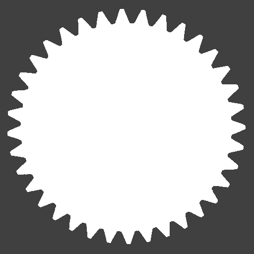

```@meta
CurrentModule = Regions
DocTestSetup = quote
    using Regions
end
```

# Morphological Operations

Morphological operations transform a region using a second region called a **structuring
element** (SE). The SE acts as a probe that is slid across every pixel; its shape and size
set the spatial scale at which features are grown, shrunk, or detected.

**Structuring elements must be centred on the origin.** Two common choices:

| SE | Construction | Character |
|----|-------------|-----------|
| Disk | `region_from_circle(0, 0, r)` | Isotropic — treats all directions equally |
| Square | `region_from_box(-r, r, r, -r)` | Axis-aligned — sharper corners, faster |

## Mathematical foundation

All operations on this page are built from two primitives — the **Minkowski sum** and the
**Minkowski difference** of two sets ``A`` and ``B``:

```math
A \oplus B = \{ a + b \mid a \in A,\, b \in B \},\qquad
A \ominus B = \{ c \mid B + c \subseteq A \}.
```

`dilation(A, B)` is `A ⊕ B` and `erosion(A, B)` is `A ⊖ B`; opening, closing, gradients,
and boundaries are all defined as compositions of these two. The internal helpers
`Regions._minkowski_addition` and `Regions._minkowski_subtraction` implement the primitives
on `Region`s. Because the formulas treat `A` and `B` symmetrically, the structuring element
can be any region — disks, boxes, polygons, line segments, even point clouds.

## Erosion

`erosion(a, se)` shrinks `a`. A pixel is kept only when the SE, placed at that pixel, fits
entirely inside `a`. Protrusions narrower than the SE are trimmed away.

```jldoctest reg
julia> region5 = region_from_box(-3, 3, 3, -3);  # 7×7 = 49 pixels

julia> se_sq   = region_from_box(-1, 1, 1, -1);  # 3×3 square SE

julia> e = erosion(region5, se_sq);

julia> area(e)                                    # shrinks to 5×5
25

julia> contains(e, -2, 0)                        # 1 pixel inside the original boundary
true

julia> contains(e, -3, 0)                        # original boundary pixel — removed
false
```

A disk SE erodes isotropically. `erosion(region_from_circle(0,0,r), region_from_circle(0,0,s))`
gives `region_from_circle(0,0,r-s)` when `r > s`.

## Dilation

`dilation(a, se)` grows `a`. A pixel is added for every pixel of the SE placed at every
pixel of `a` — equivalently, every point reachable by sliding the SE over the region.

```jldoctest reg
julia> small = region_from_box(-1, 1, 1, -1);   # 3×3

julia> d = dilation(small, se_sq);              # 3×3 dilated by 3×3

julia> area(d)                                  # grows to 5×5
25

julia> contains(d, 2, 0)                        # pixel added beyond original boundary
true
```

Dilation is the dual of erosion: `dilation(a, se) == invert(erosion(invert(a), se))`.

!!! tip "Chaining erosions and dilations"
    For convex SEs centred on the origin, two successive erosions with a 3×3 box give the
    same result as one erosion with a 5×5 box, because erosion satisfies
    ``(A \ominus B) \ominus B = A \ominus (B \oplus B)``. The same identity holds for
    dilation. This lets you build a large effective SE from cheap repeated applications of
    a small one — handy when you want a tunable amount of erosion without re-creating SEs.
    The identity does **not** hold for non-convex or off-centre SEs in general.

## Opening

`opening(a, se)` = erosion followed by dilation with the same SE. It removes foreground
features (isolated pixels, thin protrusions) smaller than the SE while leaving larger
structures nearly unchanged. The result is always a **subset** of `a`.

```jldoctest reg
julia> opening(region5, se_sq) == region5       # box survives — no features smaller than SE
true

julia> isempty(opening(Region([Run(0, 0:0)]), se_sq))  # isolated pixel is removed
true
```

Opening is idempotent: applying it twice gives the same result as applying it once.

## Closing

`closing(a, se)` = dilation followed by erosion. It fills background features (narrow gaps,
small holes) smaller than the SE while leaving the overall shape nearly unchanged. The result
always **contains** `a` as a subset.

```jldoctest reg
julia> gapped = union(region_from_box(-3, 3, -1, -3),   # two bars with a 1-column gap
                      region_from_box( 1, 3,  3, -3));

julia> area(gapped)                                      # 6 columns × 7 rows, gap missing
42

julia> c3 = closing(gapped, se_sq);

julia> contains(c3, 0, 0)                               # gap at column 0 is filled
true

julia> area(c3)                                         # gap plus rounded corners added
49
```

## Morphological Gradient

`morphological_gradient(a, se)` = `difference(dilation(a,se), erosion(a,se))`. The result
is a ring that straddles the boundary of `a`, extending one SE radius both inside and outside.

```jldoctest reg
julia> grad = morphological_gradient(region5, se_sq);

julia> area(grad)                                       # 9×9 minus 5×5
56

julia> contains(grad, -3, 0)                           # boundary pixel — in the ring
true

julia> contains(grad, 0, 0)                            # interior pixel — not in the ring
false
```

## Inner and Outer Boundary

`inner_boundary` and `outer_boundary` use a fixed 3×3 square SE and split the gradient into
the layer that lies *inside* versus *outside* the region.

```jldoctest reg
julia> ib = inner_boundary(region5);

julia> area(ib)                                        # one pixel ring inside
24

julia> contains(ib, -3, 0)                            # outermost layer of region5
true

julia> contains(ib, -2, 0)                            # second layer — not inner boundary
false

julia> ob = outer_boundary(region5);

julia> area(ob)                                        # one pixel ring outside
32

julia> contains(ob, -4, 0)                            # first pixel beyond boundary
true

julia> contains(ob, -3, 0)                            # the boundary itself — not outer boundary
false
```

## Holes and fill\_holes

`holes(a)` returns all enclosed background regions — connected components of the background
inside the bounding box that do not touch any edge. `fill_holes(a)` fills them all.

```jldoctest reg
julia> box_frame = difference(region_from_box(-3, 3, 3, -3),
                              region_from_box(-1, 1, 1, -1));  # 7×7 box with 3×3 hole

julia> hs = holes(box_frame);

julia> length(hs)                                         # one enclosed hole
1

julia> contains(hs[1], 0, 0)                             # the hole contains the origin
true

julia> filled_box = fill_holes(box_frame);

julia> area(filled_box)                                   # hole filled — back to 7×7
49

julia> contains(filled_box, 0, 0) && contains(filled_box, -3, 0)
true
```

## Gear Example

Applying morphological operations to the segmented gear illustrates each operation's effect
at the scale of the gear teeth (radius-5 disk SE for erosion/dilation, radius-8 for
opening/closing):

```julia
se5 = region_from_circle(0, 0, 5)    # disk SE, radius 5
se8 = region_from_circle(0, 0, 8)    # disk SE, radius 8
se2 = region_from_circle(0, 0, 2)    # disk SE, radius 2

eroded  = erosion(gear, se5)          # teeth shaved inward by 5 px
dilated = dilation(gear, se5)         # teeth grown outward by 5 px
opened  = opening(gear, se8)          # small protrusions removed
closed  = closing(gear, se8)          # narrow inter-tooth gaps bridged
grad    = morphological_gradient(gear, se2)   # boundary ring
filled  = fill_holes(gear)            # spoke voids and shaft hole filled
```

| Original | Eroded (r = 5) | Dilated (r = 5) |
|:--------:|:--------------:|:---------------:|
|  |  |  |

| Opened (r = 8) | Closed (r = 8) | Gradient (r = 2) |
|:--------------:|:--------------:|:----------------:|
|  |  |  |

| Holes filled |
|:-----------:|
|  |

The gradient image traces every edge in the gear — outer teeth profile, spoke edges, and
the shaft hole — as a thin white ring on the darkened original. The filled image shows the
gear outline with all interior voids removed: only the teeth profile remains.
