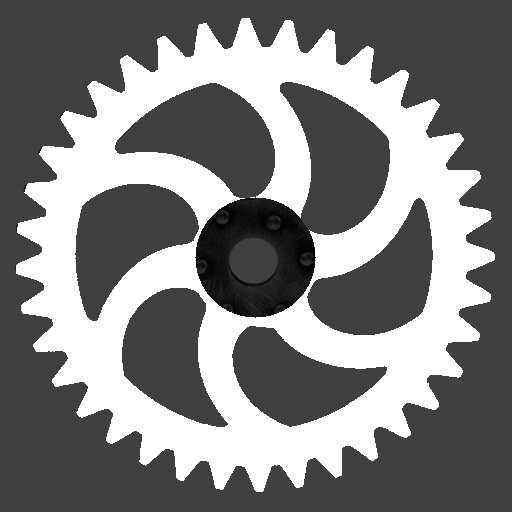
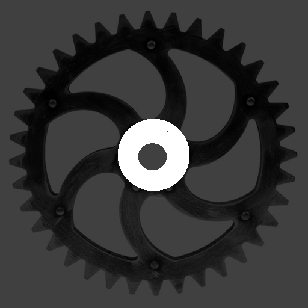

```@meta
CurrentModule = Regions
DocTestSetup = quote
    using Regions
end
```

# Set Operations

The three classical set operations — `union`, `intersection`, and `difference` — are the primary
tools for combining regions. Because a region is a set of discrete pixel coordinates, these
operations have exactly the meaning from mathematical set theory: each pixel either belongs or
does not belong to a region, and the operations determine membership in the result accordingly.

All three operations handle complement regions transparently via De Morgan's laws.
`union(invert(a), invert(b))` returns `invert(intersection(a, b))`, and so on, so regular and
complement regions can be freely mixed without special-casing.

## Union

`union(a, b)` returns every pixel that belongs to *at least one* of the two regions — the
pixel-wise logical OR. Pixels exclusive to `a`, pixels exclusive to `b`, and pixels in the
overlap all appear in the result.

```jldoctest reg
julia> a = region_from_box(0, 3, 4, 0);  # 5 columns × 4 rows = 20 pixels

julia> b = region_from_box(3, 5, 7, 2);  # 5 columns × 4 rows = 20 pixels, partly overlapping

julia> u = union(a, b);

julia> area(u)                            # 20 + 20 − 4 pixels of overlap
36

julia> contains(u, 1, 1)                 # inside a only
true

julia> contains(u, 6, 4)                 # inside b only
true

julia> contains(u, 4, 3)                 # inside both
true
```

`union` is commutative (`union(a,b) == union(b,a)`) and associative, so combining more than two
regions with `union` can be done in any order.

Typical uses: merging two separately segmented foreground regions, filling the gap between two
adjacent blobs, or stitching together partial results from parallel segmentation passes.

## Intersection

`intersection(a, b)` keeps only pixels that are present in *both* regions simultaneously — the
pixel-wise logical AND. Pixels that belong exclusively to `a` or exclusively to `b` are dropped.

```jldoctest reg
julia> i = intersection(a, b);

julia> area(i)                            # only the 2×2 overlap at columns 3–4, rows 2–3
4

julia> contains(i, 4, 3)                 # in both a and b
true

julia> contains(i, 1, 1)                 # in a only — excluded
false
```

A common pattern is *masking*: intersecting a segmented region with a geometrically defined
region of interest (a circle, a box, a polygon) restricts analysis to a specific area without
re-running segmentation.

```jldoctest reg
julia> roi = region_from_circle(2, 2, 3);  # circular region of interest

julia> masked = intersection(u, roi);      # restrict the union result to the ROI

julia> area(masked) <= area(u)
true
```

## Difference

`difference(a, b)` returns all pixels of `a` that are *not* in `b`. The operation is
asymmetric: swapping the operands generally yields a different result.

```jldoctest reg
julia> d = difference(a, b);

julia> area(d)                            # 20 − 4 overlapping pixels
16

julia> contains(d, 1, 1)                 # in a, not in b
true

julia> contains(d, 4, 3)                 # in both — excluded
false

julia> area(difference(b, a))            # subtract a from b instead
16
```

Difference is used to punch holes in a region (subtract a reference shape or a known background
area) or to isolate the part of one region not covered by another.

## Combining Operations

The three operations compose freely. A common idiom is to build a complex shape from simple
geometric primitives by alternating union and difference:

```jldoctest reg
julia> disk   = region_from_circle(0, 0, 10);

julia> hub    = region_from_circle(0, 0, 3);

julia> notch  = region_from_box(-1, 11, 1, 7);   # rectangular notch at the top

julia> ring_with_notch = difference(difference(disk, hub), notch);

julia> area(ring_with_notch) < area(disk)
true

julia> !contains(ring_with_notch, 0, 0)           # hub removed
true

julia> !contains(ring_with_notch, 0, 9)           # notch removed
true
```

## Gear Example

Building on the segmentation from the previous section, set operations refine the gear region
into analysis-ready sub-regions. A hub circle and an outer boundary circle are created
geometrically and combined with the segmented gear via `difference` and `intersection`:

```julia
using FileIO, ImageIO, ImageMagick

img  = load("gear.png")
gear = binarize(img, px -> px < 0.9)

# Approximate center and radii determined from the image dimensions (pixels)
cx, cy       = 256, 256
hub_radius   = 28
outer_radius = 240

# Remove the solid center hub — what remains are the gear teeth and body
hub        = region_from_circle(cx, cy, hub_radius)
teeth_only = difference(gear, hub)

# Trim any noise or partial pixels outside the outer gear boundary
outline       = region_from_circle(cx, cy, outer_radius)
teeth_trimmed = intersection(teeth_only, outline)

# Isolate the hub area separately for independent measurement
hub_region = intersection(gear, hub)
```

The three resulting regions — `teeth_trimmed`, `hub_region`, and the full `gear` — can now be
passed independently to area measurement, moment computation, or morphological analysis.

| Full gear | Teeth only | Hub only |
|:---------:|:----------:|:--------:|
|  |  |  |

Each image shows the segmented region in white against the darkened original photograph.
The teeth image has the inner hub circle removed via `difference`; the hub image retains
only the inner disc via `intersection`.
